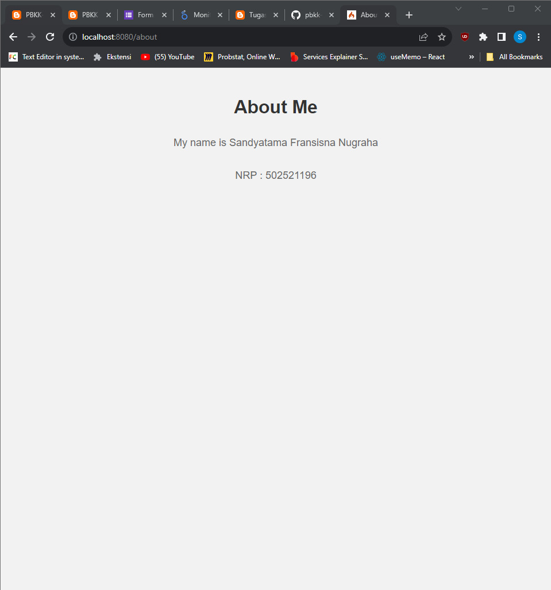
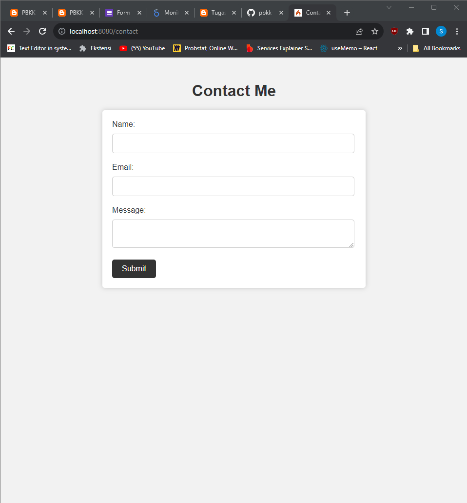
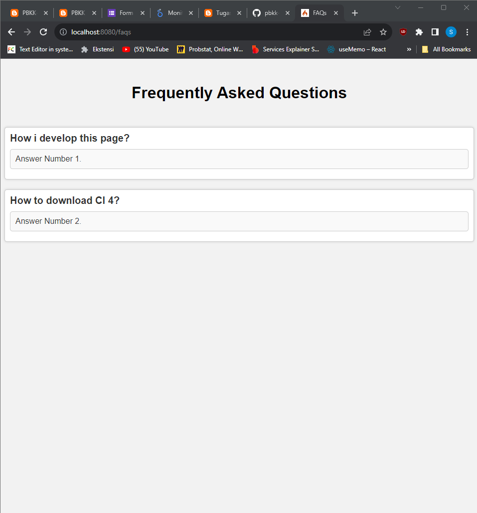

# CodeIgniter_PBKK
## Membuat Route dan Controller menggunakan Framework CodeIgniter

## Ini adalah tugas untuk membuat dan mengimplementasikan CodeIgniter dengan melakukan Route dan Controller. Kali ini saya membuat sebuah 3 route dan 3 Page dengan About, Contact, dan FAQS. 

## Langkah - Langkah Yang Dilakukan :
## 1. Untuk setting Route, dapat melakukan konfigurasi dalam directory "app\Config\Routes.php". 
## 2. Untuk setting Page, dapat melakukan konfigurasi dalam direktory "app\Controllers". Buat file baru dengan nama Page.php terlebih dahulu dan lakukan setting pada file Page.php
## 3. Lakukan setting pada file .php di "app\Views" dengan nama yang ingin dinamakan 

### 1. Hasil Page About

### 2. Hasil Page Contact

### 3. Hasil Page faqs
